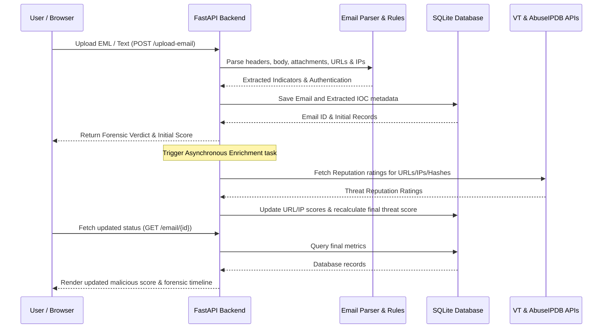

# Software Design Document (SDD) - Phishing Email Detector

## 1. System Architecture Overview
The system follows a classic **Three-Tier Architecture**:
1. **Presentation Layer (Frontend)**: A responsive single-page React application powered by Vite, providing interactive dashboards, drop-zones, log filtering, and detail inspector tabs.
2. **Application Layer (Backend)**: A high-performance FastAPI server running on Uvicorn, hosting REST endpoints, running the parsing/rules engine, and scheduling asynchronous background lookups.
3. **Data Layer (Database)**: A local SQLite database managed via SQLAlchemy ORM, resolving paths relative to the backend directory.

---

## 2. Directory Structure

```
email-threat-intel/
├── backend/
│   ├── app/
│   │   ├── core/           # Business logic (parsing, heuristics rules, mail auth)
│   │   ├── models/         # SQLAlchemy models and SQLite connection setup
│   │   ├── services/       # VirusTotal, AbuseIPDB client, PDF generator
│   │   └── main.py         # REST routing, startup events, and background tasks
│   ├── tests/              # Automated unit tests for API and parser
│   ├── requirements.txt    # Python packages list
│   └── run.py              # Backend entrypoint startup script
│
└── frontend/
    ├── public/             # SVGs and static assets
    ├── src/
    │   ├── assets/         # App icons & graphics
    │   ├── api.js          # API connection wrappers (fetch client)
    │   ├── App.jsx         # Main React SPA component containing views and state
    │   ├── index.css       # Styling sheet (dark mode, glassmorphism UI)
    │   └── main.jsx        # React entrypoint mounting script
    └── package.json        # Frontend Node dependencies list
```

---

## 3. Technology Stack & Core Packages
- **Backend Framework**: FastAPI (0.104.1) + Uvicorn (0.24.0)
- **Database Engine & ORM**: SQLite + SQLAlchemy (2.0.23)
- **Email Security Protocols**: `dnspython` (SPF DNS lookup), `dkimpy` (DKIM signature validation), `pyspf` (Sender Policy Framework logic)
- **PDF Reporting Engine**: `reportlab` (4.1.0)
- **Frontend library**: React (19.2) + Vite (5.4)
- **Icons library**: Lucide React (1.21.0)

---

## 4. Key Components Design

### 4.1 Backend Engine Components
- **EmailParser (`app/core/parser.py`)**: Utilizes python's standard library `email` package to decode raw headers, extract the text/html body content, isolate attachments, search body text for IPv4/IPv6 addresses and HTTP/HTTPS URLs.
- **RuleBasedDetector (`app/core/rules.py`)**: Defines regular expressions and rule scores for email heuristics. Evaluates subject lines for urgency, looks for suspicious links/shorteners, and flags typical phishing wording.
- **Authentication Checkers (`app/core/auth_checks.py`)**:
  - `validate_spf`: Queries TXT DNS records to check if the sender IP is authorized to mail on behalf of the sender's domain.
  - `validate_dkim`: Verifies the cryptographic signature contained in the email header against the sender's public DNS key.
  - `validate_dmarc`: Checks DMARC alignment using SPF and DKIM validation outcomes.
- **Services (`app/services/`)**:
  - `virustotal.py`: Issues async HTTP queries to check reputations of parsed URLs and attachment SHA-256 hashes.
  - `abuseipdb.py`: Issues async queries to check spam reports and abuse scores of extracted IP addresses.
  - `report_generator.py`: Generates PDF layout structure containing header, stats dashboard table, forensic logs grid, and timestamp details.

### 4.2 Frontend Design
- **`App.jsx`**: Acts as a state orchestrator holding navigation state, dashboard summary metrics, logs, details, and drag/drop triggers.
- **`api.js`**: Reusable modules encapsulating endpoints fetches with error-handling logic.
- **`index.css`**: Renders sleek dark-themed layouts using CSS custom properties (color palettes: deep space gray, neon blue, neon green, bright crimson) and glassmorphic card panels.

---

## 5. System Data Flow


